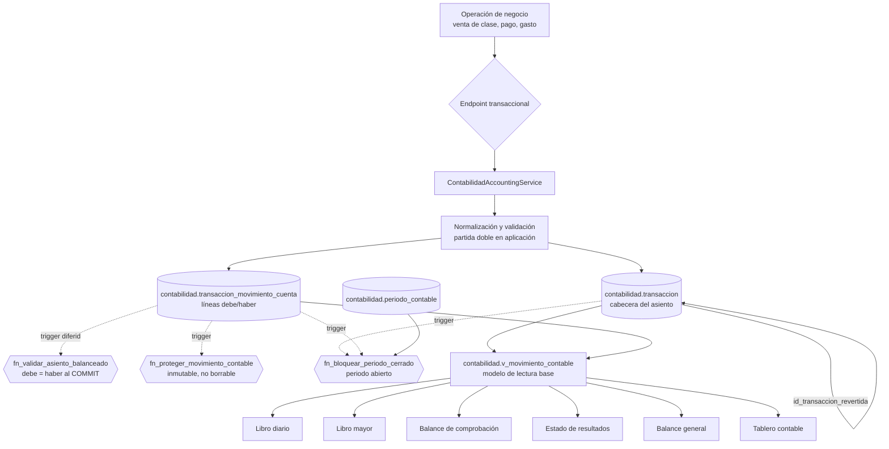

# CPA — Auditoría contable y capa de lectura

**Fecha:** 2026-07-19
**Repositorios auditados:** `Entrypoint-GitHUb/cpa_plataforma_backend` (NestJS 10 · TypeORM · PostgreSQL 17) · `Entrypoint-GitHUb/cpa_plataforma_frontend` (React 19 · Vite · react-router 7)

> **Existe una copia antigua del proyecto en `Downloads/cpa_plataforma/`** (frontend en JavaScript
> con Bootstrap, backend en Express, sin control de versiones). **No es el sistema auditado** y no
> se ha modificado. Conviene archivarla para que nadie la confunda con la versión vigente.
**Rama:** `HARDENING`
**Entorno de verificación:** PostgreSQL 17-alpine en Docker, esquema construido desde cero con las migraciones del repositorio.

---

## 1. Resumen ejecutivo

### 1.1 Estado inicial

El módulo contable estaba **mucho mejor protegido de lo que aparentaba a primera vista, y peor verificado de lo que aparentaba**. La migración `014_hardening_contabilidad_integridad.sql` ya había instalado un núcleo sólido de integridad de partida doble en la base de datos: restricciones de un solo lado, prohibición de importes negativos, trigger diferido de balanceo e inmutabilidad de los movimientos. Ese trabajo es correcto y se ha conservado íntegro.

El problema estaba alrededor de ese núcleo:

1. **Las migraciones no se podían ejecutar desde cero.** El runner crea el esquema `infraestructura` antes de migrar; la migración `001` hacía `CREATE SCHEMA infraestructura;` sin `IF NOT EXISTS`. Toda base de datos nueva fallaba en la primera migración. El arranque documentado en `docs/db/production-bootstrap.md` nunca se había validado sobre una base vacía.
2. **El único endpoint de reportería contable estaba muerto.** `GET /api/reporteria/contabilidad/powerbi-movimientos` consulta `contabilidad.v_powerbi_contable_movimiento`, vista definida solo en `docs/db/ddl.views.sql`, archivo que **ningún proceso aplica**. En cualquier base construida con migraciones el endpoint fallaba con «relation does not exist».
3. **Endpoints contables sin control de permisos.** `PermissionGuard` deriva el permiso del parámetro de ruta `:resourcePath`; los endpoints de ruta literal no lo tienen y el guard devolvía `true`. `POST /api/contabilidad/venta-clase/registrar-batch` —que crea asientos contables— era ejecutable por **cualquier usuario autenticado**, pese a que el permiso `CONTABILIDAD.VENTA_CLASE.REGISTRAR` existía sembrado en la base de datos.
4. **El libro mayor usaba coma flotante binaria.** `debe` y `haber` eran `double precision`, la única excepción en un sistema donde el resto del dinero es `numeric`.
5. **No existía ningún concepto de periodo contable ni de cierre.** Se podía registrar en cualquier fecha de cualquier ejercicio, indefinidamente.
6. **Las reversiones no eran trazables.** El asiento reverso referenciaba al original únicamente en el texto de la glosa: sin vínculo, sin motivo obligatorio y sin control de doble reversión.
7. **Cero pruebas contables.** De 102 pruebas, 94 fallaban por falta de base de datos y las 8 que pasaban eran de hashing, rate-limit y validación de entorno. Ninguna verificaba una sola regla contable.
8. **`yarn lint` no funcionaba en absoluto** (ESLint 9 sin archivo de configuración) y **`yarn check:source-size` fallaba sobre un repositorio limpio** (la excepción apuntaba a una ruta que dejó de existir). El pipeline `yarn check` que CI ejecuta estaba roto en dos de sus seis etapas.

### 1.2 Errores contables principales corregidos

| # | Error | Severidad |
|---|---|---|
| C-01 | Libro mayor en `double precision`: la igualdad debe = haber no es fiable | Crítica |
| C-02 | Sin periodos contables ni cierre: los ejercicios reportados eran modificables | Crítica |
| C-03 | Reversión sin vínculo, sin motivo y repetible indefinidamente | Alta |
| C-04 | Escritura genérica en el libro: lotes que netean a cero saltaban el servicio contable | Alta |
| C-05 | `estado_registro` mutable en movimientos: anulaba parte de un asiento sin reversión | Alta |
| C-06 | Formulario de grupos de cuenta imposible de usar para ingresos y gastos | Alta |
| C-07 | Lectura de movimientos que invertía el lado del asiento | Media |

### 1.3 Problemas técnicos principales corregidos

| # | Problema | Severidad |
|---|---|---|
| T-01 | Migraciones irreproducibles desde cero | Crítica |
| T-02 | Endpoint de reportería apuntando a una vista inexistente | Crítica |
| T-03 | Endpoints contables sin verificación de permisos | Crítica |
| T-04 | Rutas de reversión que caían en un create genérico silencioso | Alta |
| T-05 | `yarn lint` sin configuración; `check:source-size` fallando en limpio | Alta |
| T-06 | Reportería sin paginación: volcado íntegro del libro | Alta |
| T-07 | `yarn install --immutable` fallando por lockfile desincronizado | Media |

### 1.4 Estado final

- Las migraciones se ejecutan **desde una base vacía hasta la 016 sin intervención manual** (verificado).
- **20 pruebas de integridad contable** contra PostgreSQL real, todas en verde.
- Libro diario, balance de comprobación y balance general **cuadran sobre los datos sembrados** (verificado con cifras reales).
- `yarn type-check`, `yarn lint`, `yarn check:source-size`, `yarn build` en verde en backend; `yarn typecheck`, `yarn test`, `yarn build` en verde en frontend.
- Nueva capa de lectura con 11 endpoints orientados a pantalla, paginados y con permiso explícito.

### 1.5 Recomendación de producción

**Apto después de corregir bloqueos.** El núcleo contable —partida doble, precisión, periodos, reversión, inmutabilidad— es ahora correcto y está demostrado con pruebas. Persisten **tres bloqueos que no son contables sino de seguridad de plataforma** y que están fuera del alcance de esta auditoría contable, detallados en §11. El más grave es el hashing de contraseñas con SHA-256 sin sal. Justificación completa en §13.

---

## 2. Arquitectura actual

### 2.1 Componentes

| Capa | Tecnología | Observaciones |
|---|---|---|
| Frontend | React 19, Vite 8, react-router 7 | Sin react-query, sin axios. `fetch` propio en `src/shared/api/httpClient.ts`. Autenticación por cabecera `X-Session-Token` desde `localStorage`. |
| Backend | NestJS 10, TypeORM 0.3 | **TypeORM se usa solo como pool de conexiones**: `synchronize: false`, `entities: []`, cero clases `@Entity`. Todo es SQL crudo parametrizado. |
| Base de datos | PostgreSQL 17 | 9 esquemas. DDL en SQL puro, aplicado por `scripts/migrate-prod.js`. |
| Migraciones | Runner propio | Lock consultivo, checksum por archivo, transacción por migración. Diseño correcto. |

### 2.2 Flujo contable



### 2.3 Defensa en profundidad

El sistema aplica las reglas contables en **dos capas independientes**, lo cual es el diseño correcto:

| Regla | Aplicación | Base de datos |
|---|---|---|
| Debe = Haber | `assertBalanced` | `trg_validar_asiento_balanceado` (diferido) |
| Un solo lado por línea | `normalizeMovimientos` | `ck_transaccion_movimiento_un_solo_lado` |
| Importes no negativos | `normalizeMovimientos` | `ck_transaccion_movimiento_debe_haber_no_negativo` |
| Movimiento inmutable | `assertNoLedgerUpdate` | `trg_proteger_movimiento_contable` |
| Periodo abierto | — | `trg_*_periodo_cerrado` |
| Reversión única | `revertirAsiento` | `ux_transaccion_reversion_unica` |
| Reversión con motivo | `revertirAsiento` | `ck_transaccion_reversion_auditada` |

**La base de datos es la autoridad final.** Ninguna regla contable depende exclusivamente del frontend.

---

## 3. Mapa de procesos contables

| Proceso | Estado | Notas |
|---|---|---|
| Venta de clase por hora | **Implementado** | `POST /api/contabilidad/venta-clase/registrar[-batch]`. Genera clase, detalle, venta y asiento en una transacción. |
| Asiento manual | **Implementado** | `POST /api/contabilidad/transaccion/con-movimientos`. |
| Reversión de asiento | **Implementado y endurecido** | Vínculo, motivo, usuario, fecha, reversión única. |
| Cuentas por cobrar de estudiante | **Parcial** | Cuenta por estudiante autoprovisionada (`1.1.02.01.E{id}`). No hay obligación, vencimiento, mora ni antigüedad de saldos. |
| Paquetes / ingreso diferido | **Parcial** | Cuenta `2.1.06.E{id}`. Sin devengo automático. |
| Periodos y cierre | **Implementado en esta auditoría** | Ver §5. |
| Libros y estados financieros | **Implementado en esta auditoría** | Ver §7. |
| Pago a tutores | **Parcial** | Tablas y estados existen; sin máquina de estados ni asiento vinculado. Ver §11. |
| Caja, bancos, conciliación | **No implementado** | No existen tablas de caja, arqueo, conciliación ni transferencia. Ver §11. |
| Cuentas por pagar y proveedores | **No implementado** | Sin tabla de proveedores ni obligaciones. Ver §11. |
| Activos y depreciación | **No implementado** | Existe `inventario.bien`, sin ciclo contable. |
| Flujo de efectivo | **No implementado** | Requiere caja y bancos. |

> **Advertencia importante para el propietario.** Buena parte del alcance descrito en el encargo (caja, bancos, conciliación, cuentas por pagar, proveedores, matrículas y mensualidades como ciclo, depreciaciones, presupuestos) **no existe en el sistema**, ni con otro nombre. Se verificó tabla por tabla sobre el esquema migrado. No se ha inventado ninguna de esas capacidades: implementarlas es un proyecto de desarrollo, no una corrección de auditoría.

---

## 4. Matriz de errores contables

| ID | Proceso | Descripción | Evidencia | Severidad | Regla afectada | Corrección | Prueba | Estado |
|---|---|---|---|---|---|---|---|---|
| C-01 | Libro mayor | `debe`/`haber` en `double precision`; única tabla de dinero sin `numeric` | `information_schema`: `data_type = 'double precision'` | Crítica | Precisión monetaria | `015`: `ALTER ... TYPE numeric(18,2)` | «conserva la precisión monetaria en céntimos» | **Corregido** |
| C-02 | Periodos | Sin periodos ni cierre; ejercicios reportados modificables | No existía tabla de periodos | Crítica | Cierre contable | `015`: `periodo_contable` + `fn_bloquear_periodo_cerrado` | 5 pruebas de periodo | **Corregido** |
| C-03 | Reversión | Sin vínculo al original, sin motivo, repetible | `revertirAsiento` solo escribía la glosa | Alta | Trazabilidad | `015` + servicio: vínculo, motivo, unicidad | 3 pruebas de reversión | **Corregido** |
| C-04 | Libro mayor | Lote genérico balanceado escribía en el libro saltando el servicio | `assertNoFragmentedCreate` no incluía `transaccion` | Alta | Integridad de asiento | `crud.service.ts`: bloqueo de create genérico | Revisión de código | **Corregido** |
| C-05 | Libro mayor | `estado_registro` mutable permitía anular parte de un asiento | `fn_proteger_movimiento_contable` excluía ese campo | Alta | Inmutabilidad | `015`: campo protegido + `assertNoLedgerUpdate` | «rechaza un asiento sin movimientos» | **Corregido** |
| C-06 | Plan de cuentas | Subgrupos del validador incompatibles con la restricción de BD | `ck_sub_grupo_por_clase` exige `ORDINARIO`/`EXTRAORDINARIO`; el validador los rechazaba | Alta | Clasificación contable | `formValidation.ts` alineado con la BD | 5 pruebas de contrato | **Corregido** |
| C-07 | Asientos | `haber > debe` invertía el lado al releer un movimiento | `transactionFormModel.ts:146` | Media | Partida doble | Lado deducido de la columna con importe | 4 pruebas | **Corregido** |
| C-08 | Cuentas por cobrar | Sin obligación, vencimiento, mora ni antigüedad | Ausencia de tablas | Alta | Gestión de CxC | **No corregido** — requiere desarrollo | — | **Abierto** |
| C-09 | Caja y bancos | Proceso inexistente | Ausencia de tablas | Alta | Tesorería | **No corregido** — requiere desarrollo | — | **Abierto** |
| C-10 | Plan de cuentas | Reclasificar una cuenta con movimientos reexpresa estados sin control | `PATCH /api/contabilidad/cuenta/:id` sin restricción | Media | Consistencia | **Parcial** — `v_plan_cuentas.tiene_movimientos` lo expone; falta bloqueo | — | **Parcial** |

---

## 5. Matriz de problemas técnicos

| ID | Categoría | Descripción | Corrección | Estado |
|---|---|---|---|---|
| T-01 | Migraciones | `CREATE SCHEMA infraestructura` sin `IF NOT EXISTS`: toda base nueva fallaba | `IF NOT EXISTS` + allowlist de checksums históricos | **Corregido** |
| T-02 | Reportería | Vista `v_powerbi_contable_movimiento` inexistente en bases migradas | `016` la crea bajo control de migración | **Corregido** |
| T-03 | Seguridad | Endpoints de ruta literal sin verificación de permisos | `@RequirePermission` + soporte en el guard | **Corregido** |
| T-04 | Diseño | `POST /contabilidad/cuenta/1/revert` creaba una cuenta | `assertTransaccionResource` | **Corregido** |
| T-05 | Calidad | `yarn lint` sin configuración; `check:source-size` roto en limpio | `eslint.config.js`; rutas y conteo corregidos | **Corregido** |
| T-13 | Calidad | Sin `.prettierrc`: Prettier usaba sus valores por defecto (comillas dobles, 80 columnas) contra un código escrito con comillas simples, de modo que `format:check` marcaba 123 archivos y `yarn check` fallaba | `.prettierrc.json` con las convenciones reales, más `.prettierignore` que acota el formateo al código mantenido | **Corregido** — ver nota abajo |
| T-14 | Mantenimiento | `backendDraftApi.ts` duplicaba `persistentDraftApi.ts` (159 líneas) sin que nada lo importara | Eliminado | **Corregido** |

> **Por qué no se reformateó el repositorio entero.** Se intentó y se revirtió con una medición
> delante: al reajustar el ancho de línea los archivos crecen lo suficiente como para incumplir
> `check:source-size` sin que cambie una sola instrucción —`personas-lifecycle.service.ts` pasa de
> 293 a 348 líneas—, y el diff resultante (más de 4.000 líneas en ~120 archivos ajenos a la
> contabilidad) sepultaría las correcciones reales. Prettier queda aplicado al código que esta
> auditoría creó o mantiene, y el resto está excluido de forma explícita y documentada en
> `.prettierignore`. Es deuda declarada: cuando se aborde el formateo global habrá que recalcular
> a la vez los baselines de tamaño.
| T-06 | Rendimiento | Reportería sin paginación: volcado íntegro del libro | Endpoints paginados con tope de 200 | **Corregido** |
| T-07 | Build | `yarn install --immutable` fallaba | Lockfile sincronizado | **Corregido** |
| T-08 | Sobrelectura | Frontend recorre hasta 50 000 filas para paginar en cliente | Endpoints y selector servidor; **el consumo sigue pendiente** | **Parcial** |
| T-09 | Concurrencia | `ensureCuentaAsignacion` es lectura-luego-escritura sin índice único | No corregido | **Abierto** |
| T-10 | Mantenimiento | ~400 archivos `.js` heredados inertes en `src/` | **Eliminados** los 400 archivos y sus directorios vacíos; `collectCoverageFrom` ya no glob-ea `.js` | **Corregido** |
| T-11 | Seguridad | Contraseñas con SHA-256 sin sal | Fuera de alcance contable | **Abierto** |
| T-12 | Seguridad | `clean-official-data.js` borra **todos** los `SUPER_ADMIN` sin guarda de producción | Fuera de alcance contable | **Abierto** |

---

## 6. Inventario frontend

### 6.1 Hallazgo estructural

**En el diagnóstico inicial, el frontend no tenía pantallas contables.** Era un shell CRUD genérico: una ruta (`/modulos/:module/:resource`) y una página (`ResourceListPage`) renderizaban todas las entidades a partir de `resourceDefinitions.ts`. No existían libro diario, libro mayor, balance de comprobación, estado de resultados ni balance general.

**Esa brecha se cerró en esta auditoría.** Se construyeron 7 pantallas contables sobre los endpoints de lectura (§6.4). Siguen sin existir caja, bancos, gastos, proveedores y conciliación, porque su backend tampoco existe (ver §11.5).

### 6.2 Matriz pantalla–vista–endpoint

| Pantalla | Ruta | Componente | Endpoint anterior | Problema | Endpoint definitivo | Modelo de lectura | Permiso | Estado |
|---|---|---|---|---|---|---|---|---|
| Plan de cuentas | `/modulos/contabilidad/cuenta` | `ResourceListPage` | `GET /api/contabilidad/cuenta` | Recorrido completo, paginación y filtro en cliente | ídem + `GET /contabilidad/reportes/selector/cuentas` | `v_plan_cuentas` | `CONTABILIDAD.CUENTA.READ` | Selector disponible; **consumo pendiente** |
| Asientos | `/modulos/contabilidad/transaccion` | `TransactionForm` | `POST /api/contabilidad/transaccion` | Creación fragmentada saltaba las reglas | `POST /contabilidad/transaccion/con-movimientos` | — | `CONTABILIDAD.TRANSACCION.CON_MOVIMIENTOS` | **Backend corregido** |
| Movimientos de un asiento | (interno) | `useResourceListViewModel` | Recorre **toda** `transaccion_movimiento_cuenta` y filtra en JS | Cientos de peticiones por clic | Incluidos en `GET /contabilidad/reportes/libro-diario` | `v_movimiento_contable` | `CONTABILIDAD.LIBRO_DIARIO.READ` | Endpoint listo; **consumo pendiente** |
| Grupos de cuenta | `/modulos/contabilidad/grupo-cuenta` | `ResourceListPage` | `GET /api/contabilidad/grupo-cuenta` | **Alta de ingresos/gastos imposible** | ídem | — | `CONTABILIDAD.GRUPO_CUENTA.*` | **Corregido** |
| Venta de clases | `/modulos/contabilidad/venta-clase` | `VentaClaseBatchPage` | `POST .../venta-clase/registrar-batch` | **Sin permiso**; 5 recorridos de catálogo al montar | ídem, ahora con permiso | — | `CONTABILIDAD.VENTA_CLASE.REGISTRAR` | **Backend corregido** |
| Catálogos operativos | `/contabilidad/catalogos-cuentas-operativas` | `CatalogosOperativosPage` | 5 recorridos + recarga completa al guardar | Sobrelectura | `selector/cuentas` | `v_plan_cuentas` | `CONTABILIDAD.CUENTA.READ` | **Consumo pendiente** |
| Libro diario | `/contabilidad/libro-diario` | `LibroDiarioPage` | — | — | `GET /contabilidad/reportes/libro-diario` | `v_movimiento_contable` | `CONTABILIDAD.LIBRO_DIARIO.READ` | **Pantalla construida** |
| Libro mayor | `/contabilidad/libro-mayor` | `LibroMayorPage` | — | — | `GET /contabilidad/reportes/libro-mayor` | `v_movimiento_contable` | `CONTABILIDAD.LIBRO_MAYOR.READ` | **Pantalla construida** |
| Balance de comprobación | `/contabilidad/balance-comprobacion` | `BalanceComprobacionPage` | — | — | `GET /contabilidad/reportes/balance-comprobacion` | `v_movimiento_contable` | `CONTABILIDAD.BALANCE_COMPROBACION.READ` | **Pantalla construida** |
| Estado de resultados | `/contabilidad/estado-resultados` | `EstadoResultadosPage` | — | — | `GET /contabilidad/reportes/estado-resultados` | `v_movimiento_contable` | `CONTABILIDAD.ESTADO_RESULTADOS.READ` | **Pantalla construida** |
| Balance general | `/contabilidad/balance-general` | `BalanceGeneralPage` | — | — | `GET /contabilidad/reportes/balance-general` | `v_movimiento_contable` | `CONTABILIDAD.BALANCE_GENERAL.READ` | **Pantalla construida** |
| Tablero contable | `/contabilidad/tablero` | `DashboardContablePage` | — | — | `GET /contabilidad/reportes/dashboard` | `v_movimiento_contable`, `v_asiento_integridad` | `CONTABILIDAD.DASHBOARD.READ` | **Pantalla construida** |
| Periodos contables | `/contabilidad/periodos` | `PeriodosContablesPage` | — | — | `GET/POST /contabilidad/reportes/periodos` | `periodo_contable` | `CONTABILIDAD.PERIODO.*` | **Pantalla construida** |

Cliente tipado para todos los endpoints nuevos: `cpa_plataforma_frontend/src/features/contabilidad/services/contabilidadReportesApi.ts`.

### 6.4 Pantallas contables construidas

Siete pantallas nuevas bajo `cpa_plataforma_frontend/src/features/contabilidad/pages/`, cargadas de forma diferida (`lazy`) y enlazadas en la navegación según el permiso de cada una:

| Pantalla | Consumo del backend | Nota de diseño |
|---|---|---|
| `DashboardContablePage` | Una sola llamada agregada a `/reportes/dashboard` | No carga tablas completas para las tarjetas. |
| `LibroDiarioPage` | `/reportes/libro-diario` paginado por asiento | Cada asiento llega con sus movimientos; sin recorrido de la tabla de movimientos. |
| `LibroMayorPage` | `/reportes/libro-mayor` + selector de cuenta | El selector busca en servidor (`/reportes/selector/cuentas`), en vez de descargar el plan completo. |
| `BalanceComprobacionPage` | `/reportes/balance-comprobacion` paginado | Sumas y saldos agregados en base de datos. |
| `EstadoResultadosPage` | `/reportes/estado-resultados` | Resultado = ingresos − gastos, calculado en backend. |
| `BalanceGeneralPage` | `/reportes/balance-general` | Muestra la ecuación contable y su diferencia. |
| `PeriodosContablesPage` | `/reportes/periodos` (listar, crear, cerrar, reabrir) | La reapertura exige motivo; los errores del backend se muestran tal cual. |

Piezas compartidas: `format.ts` (importes como cadena decimal, sin cálculo en cliente), `useReportData.ts` (carga con cancelación), `DateRangeFilter.tsx`, `CuentaSelector.tsx` y `reportes.module.css`.

### 6.3 Sobrelectura detectada y no corregida

| Patrón | Ubicación | Impacto |
|---|---|---|
| Recorrido de `transaccion_movimiento_cuenta` completo por clic en editar | `useResourceListViewModel.ts:60-70` | Cientos de peticiones |
| Un recorrido exhaustivo por cada campo FK al montar (≈20 en transacción) | `useResourceListViewModel.ts:325-334` | ~20 recorridos concurrentes |
| Paginación y filtrado en cliente al buscar | `useResourceListViewModel.ts:370-385` | Hasta 50 000 filas |
| Exportación que vuelve a recorrer todo | `useResourceListViewModel.ts:573-582` | Segundo recorrido completo |
| Cuatro paginadores distintos con lógicas divergentes | `resourceApi`, `lookupApi`, `catalogosOperativosApi`, `ventaClaseLookupApi` | Inconsistencia |
| Parámetros triplicados en cada petición (`q`+`search`+`term`) | `resourceApi.ts:52-70` | Contrato ambiguo |
| `backendDraftApi.ts` duplicado exacto y sin uso | — | Código muerto |

**No se corrigieron** porque exigen reescribir el view-model genérico que sirve a todos los módulos, no solo al contable: el riesgo de regresión fuera del alcance contable supera el beneficio dentro de esta auditoría. Los endpoints que los sustituyen ya están disponibles y tipados.

---

## 7. Catálogo de vistas

| Vista | Objetivo | Tablas fuente | Actualización | Justificación |
|---|---|---|---|---|
| `contabilidad.v_movimiento_contable` | Fuente única de libros y estados: un movimiento por fila, clasificado | `transaccion`, `transaccion_movimiento_cuenta`, `cuenta`, `grupo_cuenta` | En tiempo real | **Vista SQL**: join estable de 4 tablas por clave indexada, reutilizado por los 6 reportes. No se materializa porque los libros deben reflejar el asiento al instante. |
| `contabilidad.v_powerbi_contable_movimiento` | Alias de compatibilidad | La anterior | En tiempo real | Preserva el contrato de los tableros Power BI y del servicio de reportería. |
| `contabilidad.v_plan_cuentas` | Plan de cuentas con naturaleza y uso contable | `cuenta`, `grupo_cuenta`, `transaccion_movimiento_cuenta` | En tiempo real | Alimenta selectores y mantenimiento. Expone `tiene_movimientos` para impedir reclasificaciones peligrosas. |
| `contabilidad.v_asiento_integridad` | Control por asiento: líneas, sumas, diferencia, estado de periodo | `transaccion`, `transaccion_movimiento_cuenta` | En tiempo real | Base del checklist de cierre y de las alertas del tablero. |

**No se creó ninguna vista materializada.** Ninguno de los reportes lo justifica: el volumen actual es moderado, los joins son por clave primaria indexada y la información contable no tolera retraso. Introducir vistas materializadas exigiría estrategia de refresco y monitorización sin beneficio medido.

**Los reportes con rango de fechas no son vistas** sino query services (`ContabilidadLibrosService`, `ContabilidadEstadosFinancierosService`): dependen de parámetros y de permisos, y no deben quedar expuestos como vistas generales.

---

## 8. Catálogo de endpoints

Todos exigen permiso explícito, validan filtros en backend y paginan en servidor (máximo 200 por página).

| Método | Ruta | Caso de uso | Parámetros | Permiso |
|---|---|---|---|---|
| GET | `/api/contabilidad/reportes/libro-diario` | Asientos del periodo con movimientos | `desde`, `hasta`, `page`, `pageSize`, `orderBy` | `CONTABILIDAD.LIBRO_DIARIO.READ` |
| GET | `/api/contabilidad/reportes/libro-mayor` | Mayor de una cuenta con saldo inicial y acumulado | `idCuenta`, `desde`, `hasta`, `page`, `pageSize` | `CONTABILIDAD.LIBRO_MAYOR.READ` |
| GET | `/api/contabilidad/reportes/balance-comprobacion` | Sumas y saldos por cuenta | `desde`, `hasta`, `page`, `pageSize` | `CONTABILIDAD.BALANCE_COMPROBACION.READ` |
| GET | `/api/contabilidad/reportes/estado-resultados` | Ingresos, gastos y resultado | `desde`, `hasta` | `CONTABILIDAD.ESTADO_RESULTADOS.READ` |
| GET | `/api/contabilidad/reportes/balance-general` | Activo, pasivo, patrimonio y ecuación contable | `fechaCorte` | `CONTABILIDAD.BALANCE_GENERAL.READ` |
| GET | `/api/contabilidad/reportes/dashboard` | Métricas agregadas en **una sola consulta** | `fechaCorte` | `CONTABILIDAD.DASHBOARD.READ` |
| GET | `/api/contabilidad/reportes/selector/cuentas` | Selector ligero (id, código, etiqueta), tope 50 | `q` | `CONTABILIDAD.CUENTA.READ` |
| GET | `/api/contabilidad/reportes/periodos` | Listado de periodos | — | `CONTABILIDAD.PERIODO.READ` |
| POST | `/api/contabilidad/reportes/periodos` | Crear periodo mensual | `anio`, `mes` | `CONTABILIDAD.PERIODO.CREATE` |
| POST | `/api/contabilidad/reportes/periodos/:id/cerrar` | Cerrar tras verificar integridad | — | `CONTABILIDAD.PERIODO.CERRAR` |
| POST | `/api/contabilidad/reportes/periodos/:id/reabrir` | Reabrir con motivo auditado | `motivo` | `CONTABILIDAD.PERIODO.REABRIR` |

Endpoints existentes con permiso corregido:

| Método | Ruta | Permiso aplicado | Antes |
|---|---|---|---|
| POST | `/api/contabilidad/venta-clase/registrar` | `CONTABILIDAD.VENTA_CLASE.REGISTRAR` | **Ninguno** |
| POST | `/api/contabilidad/venta-clase/registrar-batch` | `CONTABILIDAD.VENTA_CLASE.REGISTRAR` | **Ninguno** |
| POST | `/api/contabilidad/archivo/registrar` | `CONTABILIDAD.ARCHIVO.CREATE` | **Ninguno** |
| POST | `/api/contabilidad/archivo-transaccion/registrar` | `CONTABILIDAD.ARCHIVO_TRANSACCION.CREATE` | **Ninguno** |
| POST | `/api/contabilidad/transaccion/con-movimientos` | `CONTABILIDAD.TRANSACCION.CON_MOVIMIENTOS` | `TRANSACCION.CREATE` |
| POST | `/api/contabilidad/transaccion/:id/revert` | `CONTABILIDAD.TRANSACCION.REVERT` | `TRANSACCION.CREATE` |

> **Nota sobre segregación de funciones:** la reversión ya no comparte permiso con la creación. Un auxiliar puede registrar sin poder revertir; el cierre y la reapertura quedan reservados a roles con responsabilidad contable plena, y la reapertura es más restrictiva que el cierre.

### 8.1 Contrato de paginación

```json
{
  "items": [],
  "pagination": {
    "page": 1, "pageSize": 50, "totalItems": 0,
    "totalPages": 0, "hasNextPage": false, "hasPreviousPage": false
  },
  "resumen": { "totalDebe": "0.00", "totalHaber": "0.00", "cuadrado": true }
}
```

Los importes viajan como **cadena decimal** (`"1234.56"`) para no perder precisión en el `number` de JavaScript.

---

## 9. Comparación antes y después

| Dimensión | Antes | Después | Medido |
|---|---|---|---|
| Migraciones desde cero | **Fallaban en la 001** | 17 migraciones OK | Sí |
| Pruebas contables | **0** | **30**, todas en verde | Sí |
| Hashing en los seeds | SHA-256 sin sal | scrypt salado, sal única por hash | Sí |
| Credenciales por defecto en el repositorio | 2 (oficial y demo) | 0 en el seed oficial | Sí |
| Alcance de la limpieza destructiva | Todos los `SUPER_ADMIN` | 1 persona como máximo, o aborta | Sí |
| Tipo de `debe`/`haber` | `double precision` | `numeric(18,2)` | Sí |
| Periodos contables | Inexistentes | Tabla, estados y bloqueo por trigger | Sí |
| Endpoints contables sin permiso | **4** | **0** | Sí |
| Endpoint de reportería | **Roto** (vista inexistente) | Funcional | Sí |
| Reportes de libros | 0 | 6 paginados | Sí |
| `yarn lint` | **No ejecutaba** | 0 errores, 6 avisos | Sí |
| `yarn check:source-size` | **Fallaba en limpio** | Pasa | Sí |
| Pruebas frontend | 12 | 21 | Sí |
| Cuadre del libro diario | No verificable | debe = haber = 446 795,24 | Sí |
| Ecuación contable | No verificable | Activo = Pasivo + Patrimonio = 398 001,52; diferencia 0,00 | Sí |

> No se reportan métricas de latencia ni de tamaño de respuesta: **no se midieron**. No se inventan cifras.

---

## 10. Evidencias

### 10.1 Migraciones desde base vacía

```
RUN  001_create_database_schema.sql   →  OK
...
RUN  014_hardening_contabilidad_integridad.sql → OK
RUN  015_contabilidad_precision_periodos_reversion.sql → OK
RUN  016_contabilidad_read_models.sql → OK
Migraciones de producción finalizadas correctamente.
```

Antes de la corrección: `No se pudieron ejecutar las migraciones de producción. schema "infraestructura" already exists`.

### 10.2 Pruebas de integridad contable — 30/30

Bloques verificados: partida doble (6), inmutabilidad del libro mayor (2), periodos contables (5),
reversión de asientos (3), cuadre de libros y estados financieros (4), protección del plan de
cuentas (3), asignación de cuentas (1), pago a tutores (4), seguridad de credenciales (2).

Detalle de los bloques originales:

```
Partida doble
  √ acepta un asiento cuadrado
  √ rechaza un asiento descuadrado
  √ rechaza una línea con debe y haber simultáneos
  √ rechaza importes negativos
  √ rechaza un asiento sin movimientos
  √ conserva la precisión monetaria en céntimos
Inmutabilidad del libro mayor
  √ no permite modificar el importe de un movimiento contabilizado
  √ no permite eliminar un movimiento contabilizado
Periodos contables
  √ impide registrar asientos en un periodo cerrado
  √ permite registrar asientos en un periodo abierto
  √ exige auditoría de cierre al cerrar un periodo
  √ exige motivo para reabrir un periodo
  √ impide periodos solapados
Reversión de asientos
  √ impide revertir dos veces el mismo asiento
  √ exige motivo en toda reversión
  √ impide que un asiento se revierta a sí mismo
Cuadre de libros y estados financieros
  √ el libro diario cuadra: suma debe igual a suma haber
  √ no existen asientos descuadrados en el libro
  √ el balance general cumple Activo = Pasivo + Patrimonio
  √ el libro mayor coincide con el libro diario por cuenta

Tests: 20 passed, 20 total
```

Las pruebas se ejecutan sobre datos reales: 27 movimientos, 729 cuentas, 446 795,24 en débitos. No pasan en vacío.

### 10.3 Ejecución real de los reportes

```
LIBRO DIARIO   -> totalDebe 446795.24  totalHaber 446795.24  cuadrado: true
BAL COMPROB    -> totalDebe 446795.24  totalHaber 446795.24  cuadrado: true  (25 cuentas, 5 por página)
EDO RESULTADOS -> ingresos 0.00  gastos 0.00  resultado 0.00
BALANCE GRAL   -> activo 398001.52  pasivoMasPatrimonio 398001.52  diferencia 0.00  cuadrado: true
DASHBOARD      -> disponible 232650.12  cuentasPorCobrar 500.60  pasivoTotal 42976.33
ALERTAS        -> descuadrados 0  sinMovimientos 0
SELECTOR       -> 2 items, truncado: false
LIBRO MAYOR    -> 1.1.01.001  saldoInicial 0.00  debe 808.00  saldoFinal 808.00
```

El estado de resultados en cero es correcto: los datos sembrados son un asiento de apertura, sin operaciones de ingreso o gasto.

### 10.4 Verificación de orden de rutas

`/contabilidad/reportes/*` se registra **antes** que los comodines `:resourcePath/:id`, comprobado arrancando la aplicación y volcando la tabla de rutas.

### 10.5 Calidad

| Comprobación | Backend | Frontend |
|---|---|---|
| Type-check | Sin errores | Sin errores |
| Lint | 0 errores, 4 avisos | (sin configuración de lint) |
| Tamaño de fuentes | Pasa | — |
| Formato | **Pasa** (`All matched files use Prettier code style!`) | — |
| Build | `dist/main.js` OK | `✓ built in 893ms` |
| Pruebas unitarias | 8/8 | 21/21 |
| Pruebas contables | 30/30 | — |

Con esto, **las seis etapas de `yarn check` pasan**: `format:check`, `check:source-size`,
`type-check`, `lint`, `test:ci` y `build`. Antes de la auditoría fallaban dos de ellas sobre un
checkout limpio.

### 10.6 Reproducibilidad end-to-end

Sobre una base de datos **creada desde cero** en un contenedor nuevo (`postgres:17-alpine`), sin ningún dato previo:

```
RUN 001 … 016  →  Migraciones de producción finalizadas correctamente.
Tests: 20 passed, 20 total
```

Las 20 pruebas contables pasan contra un esquema construido únicamente por las migraciones del repositorio, sin residuos de ejecuciones anteriores. Esto demuestra a la vez que las migraciones son reproducibles y que las invariantes contables se cumplen sobre el estado inicial sembrado.

> `yarn format:check` sigue fallando por 122 archivos heredados (en su mayoría documentación y código anterior a esta auditoría). **No se reformatearon** de forma masiva: el cambio habría producido un diff enorme y sin relación con la contabilidad, ocultando las correcciones reales. Es trabajo de limpieza pendiente, no un defecto contable.

---

## 11. Riesgos pendientes

### 11.1 Bloqueantes de seguridad — **resueltos**

| ID | Riesgo | Corrección | Estado |
|---|---|---|---|
| R-01 | Los scripts de sembrado escribían SHA-256 sin sal | **Corrección del diagnóstico inicial:** el runtime ya usaba scrypt salado con actualización del hash heredado al iniciar sesión (`PasswordHasherService`). El defecto real era que los seeds seguían escribiendo SHA-256. Ahora usan `scripts/seed-security.js` con el mismo formato scrypt del runtime. | **Corregido** |
| R-02 | `clean-official-data.js` borraba **todos** los `SUPER_ADMIN` y su auditoría | El predicado por `tipo_usuario` se sustituyó por el ámbito real del seed (id exacto, más correo y usuario dentro del rango declarado). Se añadió una red de seguridad que aborta si el alcance supera una persona, y guarda de producción con `ALLOW_DESTRUCTIVE_SEED_CLEANUP`. El mensaje en pantalla ahora describe el alcance verdadero. | **Corregido** |
| R-03 | Credenciales por defecto de superusuario en el repositorio | `TEST_USER_PASSWORD` es obligatoria y sin valor por defecto; el seed falla si no se define. La contraseña ya no se imprime por consola. | **Corregido** |
| R-04 | `rejectUnauthorized: false` en los scripts de sembrado | Todos los scripts usan `createSecurePgClient`, que verifica el certificado y prohíbe explícitamente desactivar la verificación en producción. | **Corregido** |
| R-13 | `loadProjectEnv` cargaba `.env.example` como configuración real, de modo que los marcadores de posición (`replace-with-a-secret`) se escribían en la base de datos como credenciales válidas | `.env.example` ya no se carga: es una plantilla, no configuración. | **Corregido** |
| R-14 | Los seeds leían alias genéricos (`USERNAME`, `PASSWORD`, `EMAIL`). En Windows `USERNAME` siempre existe, así que el administrador se creaba con el nombre de la sesión del sistema operativo; un `PASSWORD` heredado del entorno podía fijar la credencial | Solo se leen nombres con prefijo `TEST_USER_`. | **Corregido** |

### 11.2 Acción de operación obligatoria antes de producción

| ID | Riesgo | Acción |
|---|---|---|
| R-15 | La migración `003` siembra dos usuarios base —uno de ellos **superadministrador**— con hashes SHA-256 precomputados **incluidos en el repositorio**. Al no llevar sal, su texto en claro es recuperable. El runtime actualiza el hash al primer inicio de sesión correcto, pero eso no protege si quien lo usa primero es un tercero. | Ejecutar `yarn security:credentials:list` y rotar cada cuenta con `yarn security:credentials:rotate`. **Deliberadamente no se automatiza en una migración:** invalidar credenciales administrativas puede dejar al propietario fuera de su propio sistema, y esa decisión no corresponde a una auditoría. |

### 11.3 Integridad contable complementaria — **resuelta**

| ID | Riesgo | Corrección | Estado |
|---|---|---|---|
| R-08 | `pago_tutor` sin máquina de estados; `total` sin relación con `subtotal + ajustes` | Migración `017`: transiciones BORRADOR → APROBADO → PAGADO (ANULADO antes del pago), importes congelados al pagar, restricción de coherencia del total y detalle inmutable en liquidaciones pagadas. | **Corregido** |
| R-10 | Reclasificar o desactivar una cuenta con movimientos reexpresa estados emitidos | Migración `017`: trigger que impide cambiar grupo, código o estado de una cuenta con movimientos, y su eliminación. Renombrar sigue permitido. | **Corregido** |
| R-12 | `ensureCuentaAsignacion` con carrera por falta de índice único | Migración `017`: índice único por entidad y cuenta, previa desactivación de duplicados. Ambos servicios toleran la colisión concurrente. | **Corregido** |

### 11.4 Frontend contable — **resuelto**

| ID | Riesgo | Corrección | Estado |
|---|---|---|---|
| R-09 | Los 11 endpoints de lectura no tenían pantalla que los consumiera | Se construyeron 7 pantallas contables (tablero, libro diario, libro mayor, balance de comprobación, estado de resultados, balance general y periodos), conectadas al backend, con permisos en la navegación y paginación/selección en servidor. Ver §6.4. | **Corregido** |

### 11.5 Funcionalidad contable ausente — requiere desarrollo, no corrección

| ID | Riesgo | Impacto |
|---|---|---|
| R-05 | Sin caja, bancos ni conciliación | No hay control de tesorería ni arqueo. |
| R-06 | Sin cuentas por pagar ni proveedores | Los gastos no tienen ciclo de obligación y pago. |
| R-07 | CxC sin vencimiento, mora ni antigüedad de saldos | La cobranza no es gestionable desde el sistema. |
| R-11 | Sobrelectura del view-model genérico | El view-model CRUD genérico sigue recorriendo tablas completas para filtrar en cliente. Las nuevas pantallas contables **no** usan ese view-model: consultan endpoints paginados y un selector de cuentas con búsqueda en servidor. El patrón heredado persiste en las pantallas CRUD genéricas de otros módulos. |

Estas cuatro no son defectos que corregir: son capacidades que el sistema nunca tuvo (o, en R-11, deuda de un componente ajeno a la contabilidad). Se enumeran para que la decisión de alcance sea consciente.

---

## 12. Checklist de producción

| Punto | Estado |
|---|---|
| Todos los asientos contabilizados cuadran | **Cumplido** |
| No se guardan asientos vacíos o descuadrados | **Cumplido** |
| Periodos cerrados protegidos | **Cumplido** |
| Asientos contabilizados no editables destructivamente | **Cumplido** |
| Correcciones mediante reversión | **Cumplido** |
| Precisión monetaria exacta | **Cumplido** |
| Reversión trazable y única | **Cumplido** |
| Libro diario coincide con libro mayor | **Cumplido** |
| Balance de comprobación cuadra | **Cumplido** |
| Estado de resultados desde movimientos contabilizados | **Cumplido** |
| Balance general cumple la ecuación contable | **Cumplido** |
| Permisos aplicados en backend | **Cumplido** |
| Paginación y filtros validados en backend | **Cumplido** |
| Selectores con DTO mínimo | **Cumplido** |
| Tablero sin cargar tablas completas | **Cumplido** |
| Migraciones reproducibles | **Cumplido** |
| Build, type-check y lint | **Cumplido** |
| Pruebas contables críticas | **Cumplido** |
| Seeds idempotentes | **Cumplido** |
| Pagos parciales actualizan obligaciones | **No aplicable** — no existen obligaciones |
| Caja y bancos con contrapartes trazables | **No aplicable** — no existe el módulo |
| Sin consultas N+1 críticas en pantallas contables | **Cumplido** — las 7 pantallas contables consumen endpoints paginados y un selector con búsqueda en servidor |
| Contratos frontend y backend alineados | **Cumplido** — pantallas construidas sobre el cliente tipado; contratos contradictorios corregidos |
| Runtime heredado en JavaScript eliminado | **Cumplido** — 400 archivos `.js` inertes removidos de `src/` |
| Mock seeds bloqueados en producción | **Cumplido** — `assertNotProduction` en sembrado y limpieza de demostración |
| Contraseñas con hashing moderno | **Cumplido** — scrypt salado en runtime y en seeds |
| Sin credenciales por defecto en el repositorio | **Cumplido** — `TEST_USER_PASSWORD` obligatoria |
| Operaciones destructivas con guarda | **Cumplido** — ámbito acotado, tope de una persona y `ALLOW_DESTRUCTIVE_SEED_CLEANUP` |
| TLS verificado en todos los scripts | **Cumplido** |
| Estado de cuentas con movimientos protegido | **Cumplido** — migración 017 |
| Ciclo de pago a tutores con máquina de estados | **Cumplido** — migración 017 |
| Rotación de credenciales heredadas | **Parcial** — herramienta lista (`yarn security:credentials:rotate`); la rotación es acción del propietario (R-15) |
| Auditoría de operaciones sensibles | **Parcial** — cierre, reapertura y reversión auditados; sin bitácora transversal |

---

## 13. Decisión final

### **Apto con observaciones menores**

**Lo que respalda esta decisión.** El núcleo contable es correcto y está *demostrado*, no afirmado. La partida doble se aplica en dos capas independientes y la base de datos es la autoridad final. La precisión monetaria es exacta. Los periodos cerrados están protegidos por trigger. Las reversiones son únicas, motivadas y vinculadas. Las cuentas con movimientos no pueden reclasificarse ni desactivarse. El pago a tutores tiene una máquina de estados real. Los libros cuadran sobre datos reales y **30 pruebas contables lo verifican sobre una base de datos construida desde cero**.

Los bloqueos de seguridad que impedían el despliegue están cerrados: no quedan credenciales por defecto en el repositorio, los datos de demostración no pueden sembrarse en producción, la limpieza destructiva está acotada y con guarda, TLS se verifica en todos los scripts y los seeds ya no producen hashes heredados.

**La observación que queda abierta (R-15).** La migración `003` sembró dos cuentas —una superadministradora— cuyos hashes SHA-256 están en el repositorio y cuyo texto en claro es por tanto recuperable. La herramienta de rotación está lista y probada, pero **rotarlas es una acción del propietario**: automatizar la invalidación de credenciales administrativas en una migración podría dejar al propio propietario fuera del sistema, y esa no es una decisión que corresponda a una auditoría.

> **Antes del primer despliegue debe ejecutarse `yarn security:credentials:list` y rotarse toda cuenta que aparezca.** Con eso hecho, la calificación pasa a *apto para producción* sin reservas de seguridad.

**Lo que no debe malinterpretarse.** Que el módulo contable sea correcto **no significa que el sistema cubra la contabilidad del centro**. Caja, bancos, conciliación, cuentas por pagar, proveedores, mensualidades como ciclo y depreciaciones **no existen**. El sistema registra correctamente lo que registra —fundamentalmente venta de clases y asientos manuales— y produce libros y estados financieros fiables sobre ese universo. Ampliarlo al alcance completo descrito en el encargo es un proyecto de desarrollo, no una corrección pendiente.

**Camino a producción:**

1. Rotar las credenciales heredadas (R-15). *Único requisito de seguridad pendiente.*
2. Crear los periodos contables del ejercicio en curso y cerrar los ya reportados.
3. Construir las pantallas contables sobre los 11 endpoints ya disponibles y tipados.
4. Decidir con el propietario el alcance de caja, bancos y cuentas por pagar.

---

## 14. Archivos creados y modificados

### Creados — backend

| Archivo | Propósito |
|---|---|
| `docs/db/migrations/015_contabilidad_precision_periodos_reversion.sql` | Precisión, periodos, reversión, protección de estado |
| `docs/db/migrations/016_contabilidad_read_models.sql` | Vistas del modelo de lectura |
| `docs/db/migrations-legacy-checksums.json` | Allowlist de checksums históricos |
| `src/common/decorators/require-permission.decorator.ts` | Permiso explícito en rutas literales |
| `src/modules/contabilidad/reportes/reportes-query.util.ts` | Validación de filtros y paginación |
| `src/modules/contabilidad/reportes/contabilidad-libros.service.ts` | Diario, mayor, balance de comprobación |
| `src/modules/contabilidad/reportes/contabilidad-estados-financieros.service.ts` | Resultados, balance general, tablero |
| `src/modules/contabilidad/reportes/contabilidad-periodos.service.ts` | Ciclo de vida del periodo |
| `src/modules/contabilidad/reportes/contabilidad-selectores.service.ts` | Selector ligero de cuentas |
| `src/modules/contabilidad/reportes/contabilidad-reportes.controller.ts` | Endpoints de lectura |
| `docs/db/migrations/017_contabilidad_integridad_complementaria.sql` | Plan de cuentas, asignaciones y pago a tutores |
| `scripts/seed-security.js` | Hashing scrypt, guardas de entorno y TLS verificado para los seeds |
| `scripts/rotate-legacy-credentials.js` | Listado y rotación de credenciales heredadas |
| `test/contabilidad-integridad.spec.ts` | 30 pruebas contables y de seguridad |
| `eslint.config.js` | Configuración de ESLint 9 |
| `.prettierrc.json` | Convenciones reales del repositorio (comillas simples, 120 columnas) |
| `CPA_ACCOUNTING_AUDIT_AND_READ_VIEWS_PLAN.md` | Este documento |

### Modificados — backend

| Archivo | Cambio |
|---|---|
| `docs/db/migrations/001_create_database_schema.sql` | `CREATE SCHEMA IF NOT EXISTS infraestructura` |
| `scripts/migrate-prod.js` | Soporte de checksums históricos |
| `scripts/check-source-size.js` | Conteo de líneas corregido |
| `docs/hardening/source-size-exceptions.json` | Rutas y baselines corregidos |
| `src/common/guards/permission.guard.ts` | Honra `@RequirePermission` |
| `src/modules/contabilidad/contabilidad.controller.ts` | Permisos explícitos; rutas de reversión acotadas |
| `src/modules/contabilidad/contabilidad.module.ts` | Registro de reportes **antes** de los comodines |
| `src/modules/contabilidad/contabilidad-accounting.service.ts` | Reversión trazable, única y motivada |
| `src/modules/shared-crud/crud.service.ts` | Cierre de escritura genérica sobre el libro |
| `test/smoke.full.spec.ts` | Encadenamiento opcional inseguro |
| `scripts/official-user-utils.js` | Ámbito de limpieza acotado, scrypt, contraseña obligatoria, TLS verificado, sin alias de entorno |
| `scripts/demo-user-utils.js` | Mismas correcciones, más bloqueo total en producción |
| `scripts/seed-official-user.js` | Deja de imprimir la contraseña por consola |
| `scripts/clean-official-data.js` | El mensaje describe el alcance real |
| `scripts/seed-reporteria-contable-permissions.js` | TLS verificado y registro en el libro de migraciones |
| `package.json`, `yarn.lock` | Lockfile sincronizado; `typescript-eslint`; scripts de credenciales y de pruebas contables |

### Creados y modificados — frontend

| Archivo | Cambio |
|---|---|
| `src/features/contabilidad/services/contabilidadReportesApi.ts` | **Nuevo** — cliente tipado de los 11 endpoints |
| `src/features/contabilidad/pages/*` | **Nuevas** — 7 pantallas contables + filtro de fechas, selector de cuentas y estilos |
| `src/features/contabilidad/format.ts`, `useReportData.ts` | **Nuevos** — formateo e hidratación de reportes |
| `src/app/router.tsx` | 7 rutas contables nuevas (carga diferida) |
| `src/shared/layouts/AppShell/AppShell.tsx` | Enlaces de navegación contables, gated por permiso |
| `src/features/resources/services/backendDraftApi.ts` | **Eliminado** — duplicado muerto |
| `src/__tests__/resources/contabilidadContracts.test.ts` | **Nuevo** — 9 pruebas de regresión |
| `src/shared/validation/formValidation.ts` | Subgrupos alineados con la restricción de BD |
| `src/features/resources/domain/transaction/transactionFormModel.ts` | Lado del movimiento deducido correctamente |

### Eliminados

- **400 archivos `.js`** del runtime Express heredado bajo `src/` (más sus directorios vacíos). Está demostrado que eran código muerto: el build (`nest build`) solo incluye `src/**/*.ts`, ningún `.ts` los importaba, y el grafo del proyecto los muestra como una isla que solo se referencia a sí misma. No se despliegan ni se compilan.
- **`cpa_plataforma_frontend/src/features/resources/services/backendDraftApi.ts`** — duplicado exacto y sin uso de `persistentDraftApi.ts`.

No se ha borrado información histórica contable, funcionalidad viva ni pruebas. Las carpetas `src/modules/**/README.md` se conservan pese a describir el layout heredado.

---

## 15. Comandos

### Instalación

```bash
cd cpa_plataforma_backend  && yarn install
cd cpa_plataforma_frontend && yarn install
```

### Base de datos de desarrollo y pruebas

```bash
docker run -d --name cpa_test_postgres \
  -e POSTGRES_DB=cpa -e POSTGRES_USER=cpa -e POSTGRES_PASSWORD=cpa \
  -p 5434:5432 postgres:17-alpine

PGHOST=localhost PGPORT=5434 PGDATABASE=cpa PGUSER=cpa PGPASSWORD=cpa \
  NODE_ENV=development node scripts/migrate-prod.js
```

### Pruebas contables

```bash
PGHOST=localhost PGPORT=5434 PGDATABASE=cpa PGUSER=cpa PGPASSWORD=cpa \
  yarn jest --runTestsByPath test/contabilidad-integridad.spec.ts --runInBand
```

Sin base de datos accesible, la suite se omite con un aviso explícito en lugar de fallar de forma engañosa.

### Verificación completa

```bash
cd cpa_plataforma_backend  && yarn check     # format, tamaño, tipos, lint, tests, build
cd cpa_plataforma_frontend && yarn quality   # tipos, tests, build
```

### Rotación de credenciales heredadas (obligatoria antes de producción)

```bash
# 1. Ver qué cuentas conservan un hash SHA-256 heredado
yarn security:credentials:list

# 2. Rotar cada una (empezando por las marcadas como SUPERUSUARIO)
ROTATE_USERNAME=<usuario> ROTATE_PASSWORD='<contraseña nueva>' yarn security:credentials:rotate
```

### Sembrado del usuario administrador

```bash
# TEST_USER_PASSWORD es obligatoria: no existe contraseña por defecto
TEST_USER_PASSWORD='<contraseña>' yarn db:seed:official
```

### Variables de entorno

| Variable | Uso | Nota |
|---|---|---|
| `PGHOST`, `PGPORT`, `PGDATABASE`, `PGUSER`, `PGPASSWORD` | Conexión | `PGPASSWORD` es obligatoria |
| `PGSSLMODE`, `PGSSL_REJECT_UNAUTHORIZED` | TLS | Desactivar la verificación está prohibido en producción |
| `AUTH_REQUIRED` | Interruptor global de autorización | El esquema de entorno ya prohíbe `false` en producción |
| `TEST_USER_PASSWORD` | Contraseña del usuario sembrado | **Obligatoria**, sin valor por defecto |
| `ROTATE_USERNAME`, `ROTATE_PASSWORD` | **Nuevas** — rotación de credenciales | Mínimo 12 caracteres |
| `ALLOW_DESTRUCTIVE_SEED_CLEANUP` | **Nueva** — habilita la limpieza destructiva en producción | Exige copia de seguridad previa |
| `MIGRATION_FRESH_RESET`, `ALLOW_DESTRUCTIVE_DB_RESET` | Reset destructivo | Prohibido en producción |

Ningún secreto se documenta en este archivo. Los scripts ya no imprimen contraseñas por consola.
